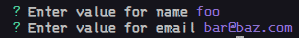

# File Generator

## How to setup

```bash
# To start in dev mode (builds and runs the script)
pnpm dev

# To build script
pnpm build

# To start from the built file
pnpm start
```

## Install globally

```bash
# TODO:
```

## How it works

To add a template file create a file in the configured templates directory (you can change it from the `src/config/index.ts` file it defaults to `templates`). subdirectories will be separated with a dash (-) for the template name.

Any file with the name "base" it'll take its parent directory's name. You can change "base" in the config file.

### Example

A file tree like this (assuming the `template` directory is the root directory for templates)

```text
templates
    ├─ license
    │   ├── MIT
    │   └── WTFPL
    ├─ lit
    │   └── base.ts
    └─ vue
        └── base.vue
```

The templates names will resolve to

- license-mit
- license-wtfpl
- lit
- vue

After creating a file inside the templates directory that's all you'll need to define a template. But you can add more configs to the `src/config/templates.ts` file, more on that [here](#more-configuration).

Now you can run `gf -t <template-name>` from anywhere and it'll create that file in the CWD.

### Cli options

- **Template:** to select a template you can pass its name to  the `--template` or `-t` flag.
- **Destination:** you can change the destination of the generated file by adding `--dest` or `-d` followed by the target location.

---

## More Configuration

By default you don't need to add any configuration. **But** most of the time generating a file isn't enough; you'd need to change the content or the filename itself.

You can do this easily by adding configuration for the template inside `src/config/templates.ts`. You can add `props` to pass down to the template file, `defaultFilename` to add a dynamic or static default filename, and/or `defaultDist` to define the relative dist the file should be created in.

### **Props**

GF [ejs](https://ejs.co/) templating engine, to resolve the passed props.

#### **Props options**

- **`default`** the default value for the property.
- **`shouldAsk`** whether should prompt for this property or just fallback to the default value. If it's not defined it'll default to `true`.
- **`hint`** add a hint to show on prompting to collect the property value.
- **`type`** the needed input type. You can set it to `input`, `confirm`, `number`, or `password`. It defaults to `input`.
- **`validator`** a validator function that takes the input value as it's argument and return a `boolean` value to validate the input.

> None of the property options are required.

#### **Pass props to a template**

Assuming you have `template/template-name.ext` template file created, and defined as follows

`templates/template-name.ext`

```ejs
<%= name %>
<% if (email) { %><%= email %><% } %>
<%= date %>
```

`src/config/template.ts`

```ts
const templatesConfig: TemplateConfig = {
  "template-name": {
    props: {
      name: {
        hint: "in kebab-case",
        validator: (v: string) => !!v.match(/^[a-z][a-z1-9-]+$/),
      }
      email: {
        validator: (v) => validateEmail(v)
      },
      date: { shouldAsk: false, default: new Date().getFullYear() },
    },
  },
};
```

#### **Passing Props**

After selecting the template

```bash
gf -t template-name
```

You will get prompt to pass the enter the required values.



This will generate the template as follows

```text
foo
bar@baz.com
2022
```

_or what ever the year you're testing this in._

#### **Template Utils**

By default there are utility functions that'll be passed to the templates generator. But you can extend them to you're own custom functions.

##### **Provided utility functions**

- **`CaseConvertor.kebabToPascal`:** will convert kebab-case string to PascalCase.
- **`CaseConvertor.kebabToCamel`:** will convert kebab-case string to camelCase.
- **`CaseConvertor.kebabToLazy`:** will convert kebab-case string to lazycase.
- **`CaseConvertor.kebabToSnake`:** will convert kebab-case string to snake_case.
- **`CaseConvertor.kebabToScreamingSnake`:** will convert kebab-case string to SCREAMING_SNAKE_CASE.

##### **Create your own utils**

To pass down a utility all you need to do is to export it from `src/config/templates-utils.ts`.

##### **How to use them**

You just use them as normal functions

```ejs
<%= CaseConvertor.kebabToPascal(name) %>
```

If provided name property was "foo-bar" it'll resolve to

```text
FooBar
```

---

### **Default Filename**

#### **Syntax**

- Any text surrounded by {} will be resolved from the provided props.
- Because most of the provided data will be passed in kebab-case, you can change the case from kebab-case by adding a comma and a one of these values
  - `c` for _camelCase_
  - `p` for _PascalCase_
  - `l` for _lazycase_
  - `s` for _snake_case_
  - `ss` for _SCREAMING_SNAKE_CASE_

##### **Examples**

```ts
const templatesConfig: TemplateConfig = {
  "template-name": {
    props: {
      name: {
        hint: "in kebab-case",
        validator: (v: string) => !!v.match(/^[a-z][a-z1-9-]+$/),
      }
    },
    defaultFilename: "{name,p}",
  },
};

/*
Assuming
- the name's value will always be foo-bar.
- ext is the current template extension.

This is how the filename will be resolved

defaultFilename: "{name}"
filename -> foo-bar.ext

defaultFilename: "{name,p}"
filename -> FooBar.ext

defaultFilename: "{name,c}"
filename -> fooBar.ext

defaultFilename: "{name}.controller"
filename -> foo-bar.controller.ext

defaultFilename: "name"
filename -> name.ext

// No defaultFilename provided
filename -> template-name.ext
*/
```

---

### **Default Distention**

Instead of having to provide the distention every time you create a file you can provide a default distention to create the file in.

All you have to do is to add `defaultDist` to the template options.

```ts
const templatesConfig: TemplateConfig = {
  "template-name": {
    props: {
      name: {
        hint: "in kebab-case",
        validator: (v: string) => !!v.match(/^[a-z][a-z1-9-]+$/),
      }
    },
    defaultFilename: "{name,p}",

    // -- here -- //
    defaultDist: path.join(process.cwd(), "src", "models"),
  },
}
```

After defining this every time you create a `template-name` template it'll be generated to a `models` directory inside the `src` directory.

---

### Config File

You can override the default dist for files for a project's scope by creating `file-generator.yaml` to the project's root.

#### **Schema**

The config file schema is provided at `schema/config.json`.

```yaml
# yaml-language-server: $schema=./schema/config.json

default-dist: "./src"

templates:
  template-name:
    dist: "./src/model"
```

##### **Options**

- `default-dist` where the file will be generated if it's dist wasn't defined.
- `templates` where each template option will be overridden.
- `template-name` the template you want to override.
- `dist` the default dist for that specific template.

#### **Change File Name, Location, or Extension**

From `src/config/index.ts` you can change settings from `configFile` to change the file location and name.

- To change the default file location change `FILE_LOCATION`.
- To change the file name to search and retrieve settings from change `FILENAME`.
- To use `json` or `jsonc` instead of `yaml` you can change `FILE_TYPE` to the extension you want to use.

---

## License

MIT.
